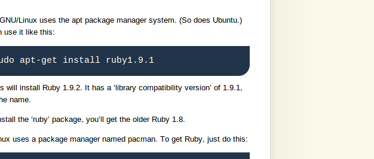

#jekyll安装

##ruby官方下载安装
http://www.ruby-lang.org

##ruby gem install 
http://docs.rubygems.org/read/chapter/3

###Installing RubyGems
Get it from RubyForge (http://rubyforge.org/frs/?group_id=126) and run (as root, if appropriate and necessary)

ruby1.9.1 setup.rb

##jekyll install
gem1.9.1 install jekyll

